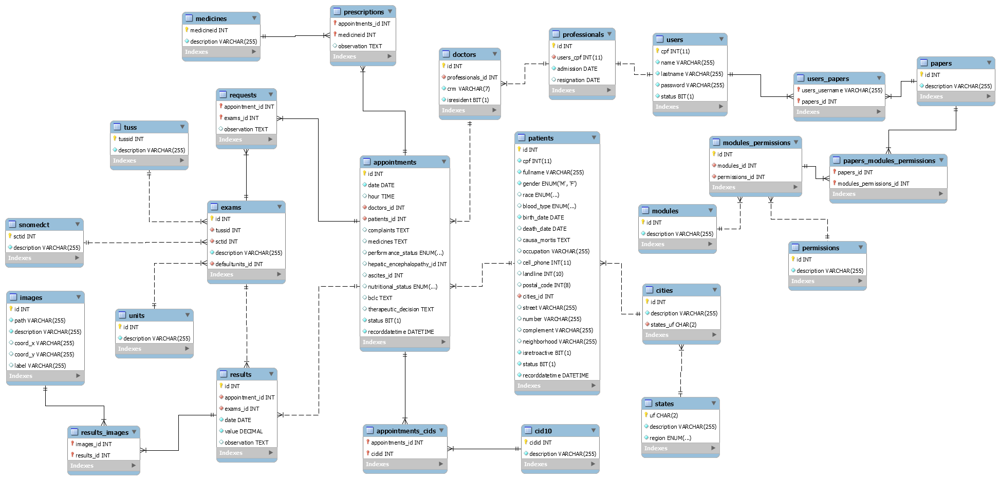

# ConectaGym

**Camila Melo Ferreira, strangerxgrimes@gmail.com**

**Luana Fleury, luana.fleury4@gmail.com**

**Rafael Ferraz Barra, rafafbarra@gmail.com**

**Samuel Lincoln de Oliveira Gomes, samuelincoln1@gmail.com**

**Victor de Souza Friche Passos, vicfriche@gmail.com**

---

Professores:

**Hugo Bastos de Paula**

**Eveline Alonso Veloso**

---

_Curso de Engenharia de Software, Unidade Praça da Liberdade_

_Instituto de Informática e Ciências Exatas – Pontifícia Universidade de Minas Gerais (PUC MINAS), Belo Horizonte – MG – Brasil_

---

_**Resumo**. Escrever aqui o resumo. O resumo deve contextualizar rapidamente o trabalho, descrever seu objetivo e, ao final, 
mostrar algum resultado relevante do trabalho (até 10 linhas)._

---

## 1. Introdução

A introdução deve apresentar de dois ou quatro parágrafos de contextualização do trabalho. 

    1.1 Contextualização

  Cientificamente é comprovado a importância de se exercitar diariamente para o corpo e a mente, mas algumas pessoas não tem tempo e força de vontade pra começar.  

 É importante considerar também a dificuldade que algumas pessoas podem apresentar devido à distância presencial para marcar suas aulas, fazer suas fichas e contratar algum personal de sua escolha, sendo tarefas muito mais simples de se realizar online. 

Por isso decidimos criar um software que tem a finalidade de facilitar a programação dos professores e alunos. Onde o cliente consegue pelo próprio celular realizar o cadastro, marcar aulas e montar a ficha, contribuindo para um melhor funcionamento do fluxo da academia.

    1.2 Problema

   Muitas pessoas enfrentam dificuldades ao tentar se exercitar e encontrar um personal trainer atualmente. Uma das maiores barreiras é o custo de frequentar uma academia e contratar um personal trainer experiente, o que pode desanimar muitas pessoas. 
    
   Outro problema é conseguir manter a motivação para se exercitar regularmente, especialmente quando se treina sozinho. Muitas vezes, as pessoas podem se sentir desanimadas ou desmotivadas. 
    
   Com isso, as restrições de tempo e horários de trabalho também podem ser um obstáculo para muitas pessoas. Encontrar tempo para se exercitar regularmente pode ser difícil, especialmente quando o trabalho e outros compromissos ocupam a maior parte do dia.
    
   Outra dificuldade é a falta de conhecimento e confiança em relação ao treinamento de musculação. Muitas pessoas podem não ter experiência anterior na academia, não saber como usar corretamente os equipamentos de treinamento ou criar um plano de treinamento eficaz. Isso pode prejudicar os resultados e levar a lesões. 
    
   Portanto, encontrar um personal trainer experiente, confiável e que encaixe no horário pode ser um desafio para muitas pessoas. Alguns treinadores podem não estar disponíveis ou podem ser muito caros, o que pode tornar difícil encontrar alguém que se adapte às necessidades e objetivos de cada indivíduo.

    1.3 Objetivo geral

Os objetivo geral deste trabalho é confeccionar um sistema a fim de facilitar a elaboração de treinos, montagem de fichas de academia e a distribuição dos alunos entre os professores disponíveis. Dessa forma os problemas identificados podem ser solucionados por meio do software que será desenvolvido neste trabalho. 

        1.3.1 Objetivos específicos

Os objetivos específicos são:
- Desenvolver um site intuitivo e responsivo
- Elaborar um sistema de cadastro de alunos
- Elaborar um sistema de cadastro de professores
- Desenvolver um sistema de login
- Desenvolver um sistema para montagem de treinos
- Desenvolver um sistema de criação de fichas de academia para cada aluno atribuído a um professor

    1.4 Justificativas

Muitas pessoas que ingressam na academia possuem pouca ou nenhuma experiência com treinamentos físicos.Tendo isso em vista, os alunos encontram dificuldade em criar rotinas de exercícios eficazes sem a orientação de um personal trainer. Entretanto, esse serviço possui altas taxas e nem sempre é possível encontrar um personal competente e que atenda à suas necessidades. Nesse sentido, o software ConectaGym busca oferecer uma alternativa acessível conectando os alunos a personal trainers qualificados a um preço razoável.

Ademais, os personal trainers frequentemente têm dificuldade em encontrar novos clientes e estabelecer um negócio confiável. Nosso software resolve esse problema, oferecendo maior visibilidade e auxiliando na construção de uma base de clientes e de sua imagem profissional. Em suma, o sistema contribui para uma melhor experiência dos alunos e personal trainers na academia, aumentando a satisfação e fidelização dos clientes. 

Como contribuições do trabalho temos a possibilidade de redução de custos operacionais das academias, uma vez que o software automatiza vários processos, como criação de fichas de treino, agendamento de aulas e atualização de dados. Além disso, o software oferece uma experiência personalizada para cada cliente, levando em consideração suas necessidades e objetivos específicos. Isso pode aumentar a eficácia dos treinos, melhorando o resultado dos clientes e, consequentemente, a imagem da academia.

## 2. Participantes do processo

O desenvolvimento de um software para academia que conecta alunos inexperientes e personal trainers envolve diversos participantes que são fundamentais para o funcionamento dos processos. A seguir, são descritos os diferentes perfis dos participantes do processo. 

Em primeiro lugar, temos o próprio personal trainer, profissionais especializados em treinamento físico e seu objetivo principal no uso do software é oferecer orientações personalizadas e suporte aos alunos inexperientes. É o responsável por criar fichas de treino para seus clientes, atualizar as fichas e marcar aulas. Seu perfil pode variar em idade, gênero e nível de experiência.  

Outro participante importante é o aluno. Ele deve fornecer informações sobre sua condição física atual, como idade, peso, altura, histórico de lesões e condições médicas, para que o personal trainer possa adaptar os treinos de acordo com as necessidades individuais de cada um. Seu objetivo no uso do software é ter acesso a um programa de treinamento personalizado e receber orientações do personal trainer para alcançar seus objetivos. O aluno é responsável por registrar seu progresso no treino, comunicando ao personal sobre qualquer problema e também pode marcar aulas. Seu perfil pode variar em idade, gênero e histórico de saúde. 

Além desses, temos o gerente de academia. Responsável pela administração da academia e pela gestão de pessoal. Seu objetivo principal no uso do software é garantir a eficiência das operações e assegurar a satisfação dos alunos e dos personal trainers. Seu perfil pode variar em idade, gênero e formação acadêmica. 

## 3. Modelagem do processo de negócio

## 3.1. Análise da situação atual

Atualmente, sistemas de academia que unem alunos a personal trainers costumam funcionar de forma integrada com softwares de gestão da academia. Eles permitem que os alunos se cadastrem na academia e escolham um personal trainer para acompanhar seu treinamento. Por meio do software, os alunos podem agendar horários, consultar informações sobre seu plano de treinamento e acompanhar seu desempenho em treinos anteriores. Os personal trainers, por sua vez, utilizam o mesmo software para gerenciar a agenda de seus alunos, planejar os treinamentos, registrar informações sobre o desempenho dos alunos e manter um histórico de seus treinamentos. Com base nas informações registradas no software, os personal trainers podem ajustar o plano de treinamento de cada aluno e monitorar seu progresso ao longo do tempo.

Em termos de processos não computacionais, as tarefas que os sistemas atuais implementam geralmente envolvem a interação entre os alunos e os personal trainers. Por exemplo, os alunos podem conversar com os personal trainers durante as sessões de treinamento para discutir suas metas, desafios e progresso. Os personal trainers, por sua vez, podem utilizar equipamentos e técnicas específicas para ajudar os alunos a alcançar seus objetivos.

No entanto, a utilização de tecnologia computacional permite que essas interações sejam mais eficientes e eficazes. Por exemplo, ao utilizar um software, os personal trainers podem ter acesso a informações mais detalhadas sobre o desempenho de cada aluno, o que lhes permite ajustar o plano de treinamento de forma mais precisa. Da mesma forma, os alunos podem ter acesso a informações mais precisas sobre seu progresso e metas, o que pode motivá-los a continuar com seu treinamento.

## 3.2. Descrição Geral da proposta

Apresente aqui uma descrição da sua proposta abordando seus limites e suas ligações com as estratégias e objetivos do negócio. Apresente aqui as oportunidades de melhorias.

## 3.3. Modelagem dos Processos

### 3.3.1 Processo 1 – NOME DO PROCESSO

Apresente aqui o nome e as oportunidades de melhorias para o processo 1. Em seguida, apresente o modelo do processo 1, descrito no padrão BPMN.

### 3.3.2 Processo 2 – NOME DO PROCESSO

Apresente aqui o nome e as oportunidades de melhorias para o processo 2. Em seguida, apresente o modelo do processo 2, descrito no padrão BPMN.

## 4. Projeto da Solução

### 4.1. Detalhamento das atividades

Descrever aqui cada uma das propriedades das atividades de cada um dos processos. Devem estar relacionadas com o modelo de processo apresentado anteriormente.

#### Processo 1 – NOME DO PROCESSO

**Nome da atividade 1**

| **Campo** | **Tipo** | **Restrições** | **Valor default** |
| --- | --- | --- | --- |
| [Nome do campo] | [Área de texto, Caixa de texto, Número, Data, Imagem, Seleção única, Múltipla escolha, Arquivo, Link, Tabela] |  |  |
| ***Exemplo:***  |    |     |
| login | Caixa de Texto | formato de e-mail |  |
| senha | Caixa de Texto | mínimo de 8 caracteres |   |

**Nome da atividade 2**

| **Campo** | **Tipo** | **Restrições** | **Valor default** |
| --- | --- | --- | --- |
| [Nome do campo] | [Área de texto, Caixa de texto, Número, Data, Imagem, Seleção única, Múltipla escolha, Arquivo, Link, Tabela] |  |  |
|    |    |     |

#### Processo 2 – NOME DO PROCESSO

**Nome da atividade 1**

| **Campo** | **Tipo** | **Restrições** | **Valor default** |
| --- | --- | --- | --- |
| [Nome do campo] | [Área de texto, Caixa de texto, Número, Data, Imagem, Seleção única, Múltipla escolha, Arquivo, Link, Tabela] |  |  |
|    |    |     |

**Nome da atividade 2**

| **Campo** | **Tipo** | **Restrições** | **Valor default** |
| --- | --- | --- | --- |
| [Nome do campo] | [Área de texto, Caixa de texto, Número, Data, Imagem, Seleção única, Múltipla escolha, Arquivo, Link, Tabela] |  |  |
|    |    |     |

### 4.2. Tecnologias

Descreva qual(is) tecnologias você vai usar para resolver o seu problema, ou seja implementar a sua solução. Liste todas as tecnologias envolvidas, linguagens a serem utilizadas, serviços web, frameworks, bibliotecas, IDEs de desenvolvimento, e ferramentas. Apresente também uma figura explicando como as tecnologias estão relacionadas ou como uma interação do usuário com o sistema vai ser conduzida, por onde ela passa até retornar uma resposta ao usuário.

## 5. Modelo de dados

Apresente o modelo de dados por meio de um modelo relacional ou Diagrama de Entidade-Relacionamento (DER) que contemple todos conceitos e atributos apresentados item anterior. 

## 6. Indicadores de desempenho

Apresente aqui os principais indicadores de desempenho e algumas metas para o processo. Atenção: as informações necessárias para gerar os indicadores devem estar contempladas no diagrama de classe. Colocar no mínimo 5 indicadores.

Usar o seguinte modelo:

| **Indicador** | **Objetivos** | **Descrição** | **Cálculo** | **Fonte dados** | **Perspectiva** |
| --- | --- | --- | --- | --- | --- |
| Percentual reclamações | Avaliar quantitativamente as reclamações | Percentual de reclamações em relação ao total atendimento |   | Tabela reclamações | Aprendizado e Crescimento |
| Taxa de Requisições abertas | Melhorar a prestação de serviços medindo a porcentagem de requisições | Mede % de requisições atendidas na semana |  | Tabela solicitações | Processos internos |
| Taxa de entrega de material | Manter controle sobre os materiais que estão sendo entregues | Mede % de material entregue dentro do mês |   | Tabela Pedidos | Clientes |

Obs.: todas as informações para gerar os indicadores devem estar no diagrama de classe **a ser proposto**

## 7.Sistema desenvolvido

Faça aqui uma breve descrição do software e coloque as principais telas com uma explicação de como usar cada uma.

## 8. Conclusão

Apresente aqui a conclusão do seu trabalho. Discussão dos resultados obtidos no trabalho, onde se verifica as observações pessoais de cada aluno. Poderá também apresentar sugestões de novas linhas de estudo.

# REFERÊNCIAS

Como um projeto de software não requer revisão bibliográfica, a inclusão das referências não é obrigatória. No entanto, caso você deseje incluir referências relacionadas às tecnologias, padrões, ou metodologias que serão usadas no seu trabalho, relacione-as de acordo com a ABNT.

Verifique no link abaixo como devem ser as referências no padrão ABNT:

http://www.pucminas.br/imagedb/documento/DOC\_DSC\_NOME\_ARQUI20160217102425.pdf

**[1.1]** - _ELMASRI, Ramez; NAVATHE, Sham. **Sistemas de banco de dados**. 7. ed. São Paulo: Pearson, c2019. E-book. ISBN 9788543025001._

**[1.2]** - _COPPIN, Ben. **Inteligência artificial**. Rio de Janeiro, RJ: LTC, c2010. E-book. ISBN 978-85-216-2936-8._

**[1.3]** - _CORMEN, Thomas H. et al. **Algoritmos: teoria e prática**. Rio de Janeiro, RJ: Elsevier, Campus, c2012. xvi, 926 p. ISBN 9788535236996._

**[1.4]** - _SUTHERLAND, Jeffrey Victor. **Scrum: a arte de fazer o dobro do trabalho na metade do tempo**. 2. ed. rev. São Paulo, SP: Leya, 2016. 236, [4] p. ISBN 9788544104514._

**[1.5]** - _RUSSELL, Stuart J.; NORVIG, Peter. **Inteligência artificial**. Rio de Janeiro: Elsevier, c2013. xxi, 988 p. ISBN 9788535237016._

# APÊNDICES

**Colocar link:**

Do código (armazenado no repositório);

Dos artefatos (armazenado do repositório);

Da apresentação final (armazenado no repositório);

Do vídeo de apresentação (armazenado no repositório).

